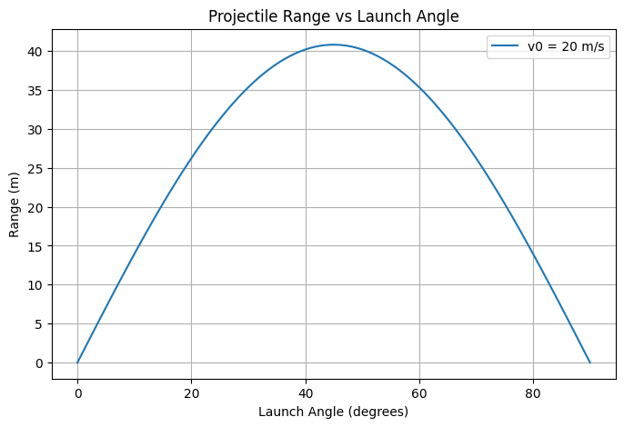

# Problem 1

### 1. **Equations of Motion**
   - Horizontal motion:
     \[
     x = v_0 \cos(\theta) \cdot t
     \]
   - Vertical motion:
     \[
     y = v_0 \sin(\theta) \cdot t - \frac{1}{2} g t^2
     \]

### 2. **Time of Flight**
   \[
   t_{\text{total}} = \frac{2 v_0 \sin(\theta)}{g}
   \]

### 3. **Range**
   \[
   R = \frac{v_0^2 \sin(2\theta)}{g}
   \]

### 4. **Maximum Range**
   \[
   R_{\text{max}} = \frac{v_0^2}{g} \quad \text{at} \ \theta = 45^\circ
   \]

### 5. **Effect of Gravity**
   The range is inversely proportional to gravity:
   \[
   R \propto \frac{1}{g}
   \]

### 6. **Symmetry of Range**
   \[
   \sin(2\theta) = \sin(180^\circ - 2\theta)
   \]
   \( \theta \) and \( 90^\circ - \theta \) yield the same range.
## 7. Implementation in Python

