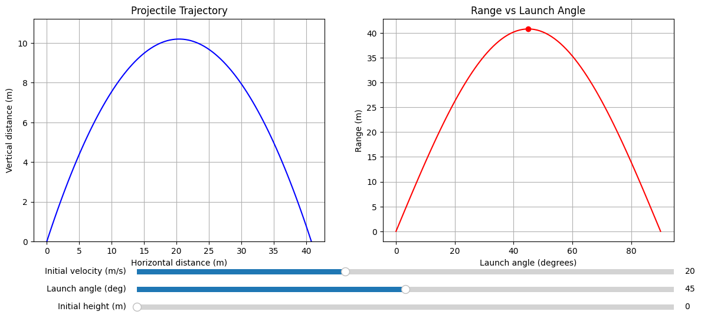

# Problem 1

# Investigating the Range as a Function of the Angle of Projection

## 1. Theoretical Foundation

### Equations of Motion

For a projectile launched with:
- Initial velocity **v₀** (m/s)
- Angle **θ** (degrees)
- Initial height **y₀** (m)
- Gravitational acceleration **g** (m/s²)

**Horizontal motion:**
```
x(t) = v₀ cosθ · t
```

**Vertical motion:**
```
y(t) = y₀ + v₀ sinθ · t - ½gt²
```

### Time of Flight

The total time in air is found when y(t) = 0:
```
t = [v₀ sinθ + √(v₀² sin²θ + 2gy₀)]/g
```

## 2. Range Analysis

### Range Equation
```
R = v₀ cosθ · t = v₀ cosθ · [v₀ sinθ + √(v₀² sin²θ + 2gy₀)]/g
```

### Special Case (y₀ = 0)
```
R = (v₀² sin2θ)/g
```

Key properties:
- Maximum range at θ = 45° (when sin2θ = 1)
- Symmetric range for complementary angles (θ and 90°-θ)
- Quadratic dependence on v₀
- Inverse dependence on g

## 3. Parameter Effects

| Parameter | Effect on Range |
|-----------|-----------------|
| **v₀** ↑ | Range increases quadratically |
| **θ** change | Creates parabolic range curve peaking at 45° |
| **y₀** ↑ | Increases range for all angles |
| **g** ↑ | Decreases range proportionally |

## 4. Practical Applications

### Real-World Considerations:
1. **Air Resistance**
   - Creates asymmetric trajectory
   - Reduces maximum range
   - Optimal angle becomes <45°

2. **Elevated Launch/Terrain**
   - Different launch and landing heights
   - Requires solving y(t) = y_terrain

3. **Wind Effects**
   - Headwind reduces range
   - Tailwind increases range
   - Crosswind causes lateral drift

4. **Projectile Characteristics**
   - Spin (Magnus effect)
   - Shape affecting drag coefficient
   - Surface texture

## 5. Model Limitations

### Ideal Model Assumptions:
1. Constant gravitational acceleration
2. No air resistance
3. Flat, uniform terrain
4. No other forces (wind, spin, etc.)
5. Point mass projectile

### Where Model Fails:
- High-velocity projectiles (significant air resistance)
- Long-range artillery (Earth's curvature, rotation)
- Sports balls (spin effects)
- High-altitude launches (changing g and air density)

## 6. Visualization Concepts

### Range vs Angle Curve:
```
    R
    ↑
    |     /\
    |    /  \
    |   /    \
    |  /      \
    | /        \
    +-----------→ θ
    0     45    90
```

### Key Features to Visualize:
1. Symmetric curve for y₀=0 case
2. Peak at 45° for basic case
3. How curve changes with:
   - Different v₀ values
   - Non-zero y₀
   - Air resistance effects
4. Comparison of ideal vs real trajectories

## 7. Extensions for Realistic Modeling

### Improved Physical Models:
1. **Air Drag Models**
   - Linear drag: F_drag = -bv
   - Quadratic drag: F_drag = -cv|v|

2. **Wind Models**
   - Constant wind velocity vector
   - Altitude-dependent wind profiles

3. **Advanced Effects**
   - Magnus effect for spinning projectiles
   - Variable atmospheric density
   - Earth's rotation (Coriolis effect)

   

## 8. Conclusion

The projectile range-angle relationship demonstrates fundamental physics principles through an elegant mathematical framework. While the basic model provides crucial insights, real-world applications require considering additional physical factors. The symmetric range curve under ideal conditions serves as a foundation for understanding more complex scenarios encountered in engineering, ballistics, and sports science.
