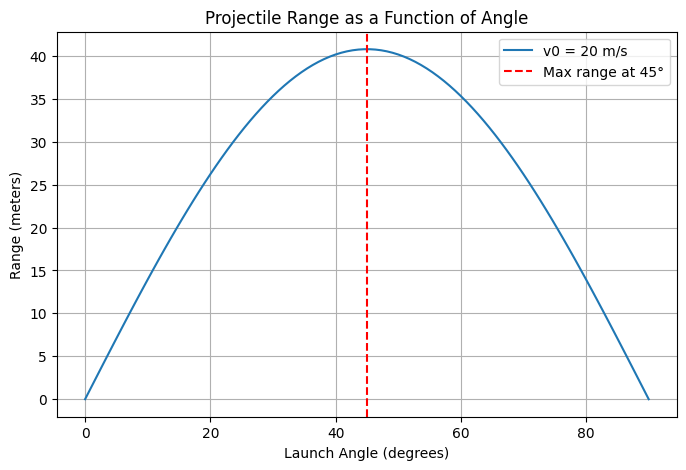

# Problem 1

---

## **1. Theoretical Foundation**
Projectile motion follows Newton’s equations of motion under the influence of gravity. Assuming no air resistance:

- The equations for motion in the horizontal and vertical directions are:

  \[
  x(t) = v_0 \cos\theta \cdot t
  \]

  \[
  y(t) = v_0 \sin\theta \cdot t - \frac{1}{2} g t^2
  \]

  where:
  - \( v_0 \) = initial velocity
  - \( \theta \) = launch angle
  - \( g \) = gravitational acceleration
  - \( x(t) \), \( y(t) \) = position at time \( t \)

- The time of flight \( T \) (when \( y = 0 \)):

  \[
  T = \frac{2 v_0 \sin\theta}{g}
  \]

- The **range** (horizontal distance when projectile lands):

  \[
  R = v_0 \cos\theta \cdot T = \frac{v_0^2 \sin(2\theta)}{g}
  \]

  This equation shows that the range is maximized when \( \theta = 45^\circ \).

---

## **2. Analysis of the Range**
- **Dependence on angle:** The function \( \sin(2\theta) \) is maximum at \( \theta = 45^\circ \), meaning the range is longest at this angle.
- **Influence of velocity:** \( R \propto v_0^2 \), meaning that doubling the initial velocity quadruples the range.
- **Effect of gravity:** \( R \propto 1/g \), so on planets with lower gravity, the range increases.

---

## **3. Practical Applications**
- **Sports:** Understanding projectile motion in soccer, basketball, or golf.
- **Engineering:** Designing ballistic trajectories for artillery or rockets.
- **Astrophysics:** Studying trajectories of celestial objects under gravity.

---

## **4. Implementation in Python**
Here’s a simple Python script to plot the range vs. launch angle:

---

## **5. Discussion on Model Limitations**
- **No air resistance:** In real life, drag reduces range.
- **Uneven terrain:** Real-world applications require adjusting for ground variations.
- **Wind effects:** Wind can alter the projectile’s path.

To improve realism, we could add drag force using numerical methods.

---

