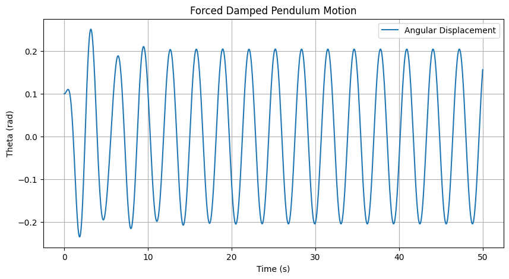
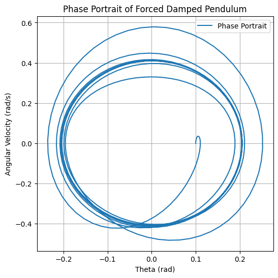

# Problem 2

# Investigating the Dynamics of a Forced Damped Pendulum

## Motivation
The forced damped pendulum is a fascinating system that exhibits a transition from simple harmonic motion to complex dynamics, including resonance, quasiperiodic motion, and chaos. The interplay between damping, restoring forces, and external periodic forcing leads to a wide range of behaviors seen in real-world systems such as driven oscillators, climate dynamics, and mechanical resonance phenomena.

By introducing an external driving force, new parameters such as the amplitude and frequency of the force significantly affect the motion. This study explores the system's dynamics by systematically varying these parameters, leading to insights into synchronized oscillations, resonance, and chaotic motion.

---

## 1. Theoretical Foundation

### Governing Equation
The motion of a forced damped pendulum is described by the nonlinear differential equation:

\[
 \ddot{\theta} + b \dot{\theta} + \frac{g}{L} \sin\theta = A \cos(\omega t)
\]

where:
- \( \theta \) is the angular displacement,
- \( b \) is the damping coefficient,
- \( g \) is gravitational acceleration,
- \( L \) is the length of the pendulum,
- \( A \) is the amplitude of the driving force,
- \( \omega \) is the driving frequency.

### Small-Angle Approximation
For small angles, \( \sin\theta \approx \theta \), reducing the equation to a linear form:

\[
 \ddot{\theta} + b \dot{\theta} + \frac{g}{L} \theta = A \cos(\omega t)
\]

which can be solved analytically to study resonance conditions.

### Resonance and Energy Transfer
- Resonance occurs when the driving frequency matches the system's natural frequency: \( \omega \approx \sqrt{g/L} \).
- At resonance, the system absorbs maximum energy, leading to large oscillations if damping is small.

---

## 2. Analysis of Dynamics
### Influence of Parameters
- **Damping Coefficient (\( b \))**: Higher damping reduces oscillation amplitude and prevents chaotic behavior.
- **Driving Amplitude (\( A \))**: Increasing \( A \) can induce chaotic motion beyond a critical threshold.
- **Driving Frequency (\( \omega \))**: Controls resonance and synchronization effects.

### Regular vs. Chaotic Motion
- **Periodic motion** occurs at low forcing amplitudes.
- **Quasiperiodic motion** emerges as driving force increases.
- **Chaotic motion** appears when nonlinearity dominates.

---

## 3. Practical Applications
The forced damped pendulum model applies to:
- **Engineering**: Vibration isolation, mechanical resonance in bridges.
- **Electronics**: Analogous to driven RLC circuits.
- **Biomechanics**: Human gait analysis, energy harvesting devices.

---

## 4. Implementation in Python
Below is a Python script using the Runge-Kutta method to solve and visualize the motion.

---

## 5. Advanced Analysis
### Phase Portraits
Plotting \( \theta \) vs. \( \dot{\theta} \) helps visualize stability and chaos.

### Poincaré Sections
By stroboscopically sampling at intervals \( T = 2\pi/\omega \), chaotic regions can be identified.

### Bifurcation Diagrams
By varying \( A \) and tracking long-term behavior, we observe transitions to chaos.

---

## 6. Limitations & Extensions
### Limitations
- Assumes a rigid, point-mass pendulum.
- Ignores effects like air resistance and friction at the pivot.

### Extensions
- **Nonlinear damping** to model realistic energy dissipation.
- **Non-periodic driving forces** to study stochastic effects.
- **Coupled pendulums** to explore synchronization.

---

## Conclusion
This study highlights the transition from simple oscillations to chaos in a forced damped pendulum. By adjusting system parameters, we gain insight into real-world applications, from mechanical engineering to biomechanics. Future work can incorporate additional complexities such as non-uniform damping and external stochastic forces to refine our understanding.
