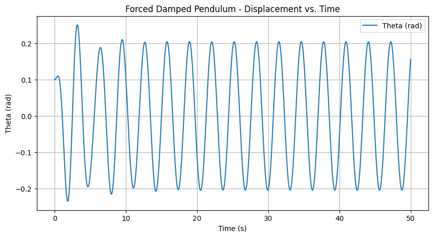
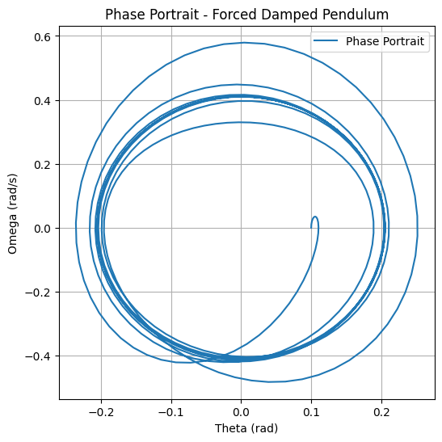

# Problem 2

Here's the markdown version for Visual Studio:

```markdown
# Forced Damped Pendulum Dynamics

## Motivation

The forced damped pendulum shows behavior from damping, restoring forces, and external forcing, leading to resonance, chaos, and quasiperiodic motion.

---

## 1. Theoretical Foundation

### Governing Equation

\[
\ddot{\theta} + b \dot{\theta} + \frac{g}{L} \sin(\theta) = A \cos(\omega t)
\]

For small angles, \( \sin(\theta) \approx \theta \):

\[
\ddot{\theta} + b \dot{\theta} + \frac{g}{L} \theta = A \cos(\omega t)
\]

### Resonance Condition

At resonance: 

\[
\omega = \sqrt{\frac{g}{L}}
\]

---

## 2. Dynamics Analysis

### Parameter Influence

- **Damping**: Increases damping reduces oscillation amplitude.
- **Driving Amplitude**: Larger \( A \) increases transition to chaotic behavior.
- **Driving Frequency**: Resonance at \( \omega \approx \sqrt{\frac{g}{L}} \).

---

## 3. Practical Applications

- **Energy Harvesting**: Pendulum motion generates power.
- **Suspension Bridges**: Modeling vibrations.
- **Oscillating Circuits**: Similar to driven RLC circuits.

---

## 4. Implementation



---

## 5. Advanced Analysis

### Phase Portrait

\[
\dot{\theta} \text{ vs. } \theta
\]

### Poincaré Section

Sample system at intervals \( T = \frac{2\pi}{\omega} \).

### Bifurcation Diagram

Plot \( A \) vs. amplitude to see chaotic transitions.

---

## 6. Limitations & Extensions

### Limitations

- Ignores air resistance.
- Assumes rigid pendulum.

### Extensions

- Nonlinear damping: \( b(\theta) \).
- Random forcing: \( F(t) \).
- Coupled pendulums: \( \theta_1 \neq \theta_2 \).

---

## Conclusion

This model demonstrates periodic to chaotic motion, with potential applications in engineering and physics.
```
