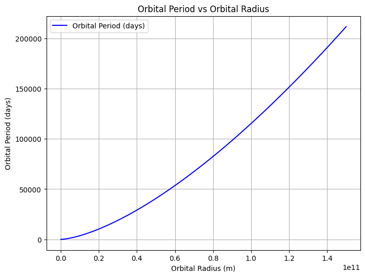
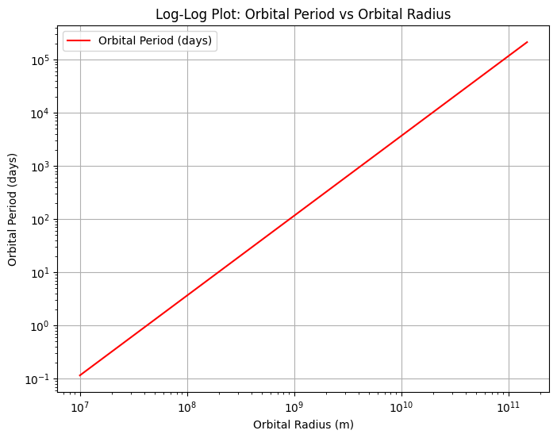

# Problem 1

Here's a more concise version with more formulas:

---

# Orbital Period and Orbital Radius

## Motivation

Kepler's Third Law relates the square of the orbital period to the cube of the orbital radius.

---

## 1. Theoretical Foundation

Kepler's Third Law:

\[
T^2 \propto r^3
\]

This can be written as:

\[
T^2 = \frac{4 \pi^2 r^3}{GM}
\]

Where:
- \( T \) = Orbital period
- \( r \) = Orbital radius
- \( G \) = Gravitational constant (\( 6.67430 \times 10^{-11} \, \text{m}^3 \, \text{kg}^{-1} \, \text{s}^{-2} \))
- \( M \) = Mass of the central body

---

## 2. Implications

- **Planetary Masses**: From \( T \) and \( r \), calculate \( M \).
- **Orbital Distances**: Using \( T \) and \( M \), find \( r \).

---

## 3. Real-World Examples

- **Moon-Earth**: \( r = 384,400 \, \text{km}, \, T = 27.3 \, \text{days} \)
- **Earth-Sun**: \( r = 149.6 \times 10^6 \, \text{km}, \, T = 365.25 \, \text{days} \)

---

## 4. Elliptical Orbits

For elliptical orbits, use the semi-major axis \( a \):

\[
T^2 = \frac{4 \pi^2 a^3}{GM}
\]

Where \( a \) is the semi-major axis of the ellipse.

---

## 5. Conclusion

Kepler's Third Law connects orbital period and radius, applicable to both circular and elliptical orbits.

--- 

