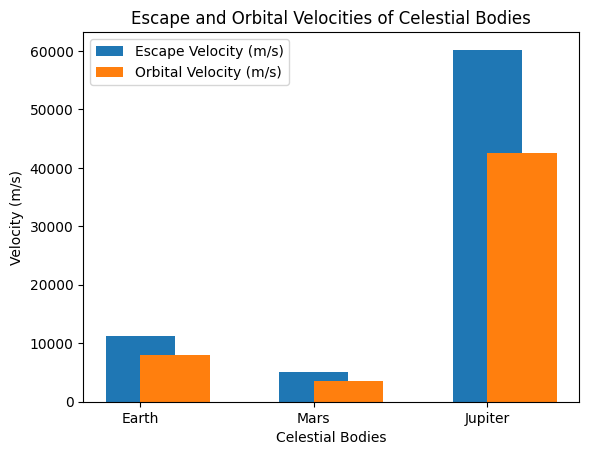

# Problem 2

---

# Escape Velocities and Cosmic Velocities

## Motivation

Escape velocity defines the minimum velocity required to escape a celestial body's gravitational pull. The first, second, and third cosmic velocities define the velocities needed for orbiting, escaping, and leaving a star system. These concepts are fundamental in space exploration.

---

## 1. Theoretical Foundation

### Escape Velocity

The escape velocity \( v_e \) is derived from energy conservation:

\[
v_e = \sqrt{\frac{2GM}{r}}
\]

Where:
- \( v_e \) = Escape velocity
- \( G \) = Gravitational constant \( (6.67430 \times 10^{-11} \, \text{m}^3 \, \text{kg}^{-1} \, \text{s}^{-2}) \)
- \( M \) = Mass of the celestial body
- \( r \) = Radius of the celestial body

This is the minimum speed needed to escape the gravitational field of the celestial body.

---

### First Cosmic Velocity (Orbital Velocity)

The first cosmic velocity \( v_1 \) is the velocity required for a stable circular orbit. The balance between gravitational force and centripetal force gives:

\[
v_1 = \sqrt{\frac{GM}{r}}
\]

Where:
- \( v_1 \) = Orbital velocity (first cosmic velocity)
- \( G \) = Gravitational constant
- \( M \) = Mass of the celestial body
- \( r \) = Radius of the celestial body

---

### Second Cosmic Velocity (Escape Velocity)

The second cosmic velocity is the same as the escape velocity, which we already derived:

\[
v_2 = v_e = \sqrt{\frac{2GM}{r}}
\]

This is the speed required to escape from the celestial body’s gravitational pull.

---

### Third Cosmic Velocity (Solar Escape Velocity)

The third cosmic velocity \( v_3 \) is the velocity required to escape the gravitational influence of the entire solar system (or a star system). The escape velocity from the Sun's gravitational field is given by:

\[
v_3 = \sqrt{\frac{2GM_{\text{Sun}}}{r_{\text{Sun}}} + \frac{2GM_{\text{Earth}}}{r_{\text{Earth}}}}
\]

Where:
- \( v_3 \) = Third cosmic velocity
- \( M_{\text{Sun}} \) = Mass of the Sun
- \( M_{\text{Earth}} \) = Mass of the Earth
- \( r_{\text{Sun}} \) = Distance from the Earth to the Sun
- \( r_{\text{Earth}} \) = Distance from the Earth to the escape point

---

## 2. Calculation and Visualization

### Escape Velocity for Different Bodies

The escape velocity is calculated as:

\[
v_e = \sqrt{\frac{2GM}{r}}
\]

For various celestial bodies:

- **Earth**:  
  - \( M_{\text{Earth}} = 5.972 \times 10^{24} \, \text{kg} \)  
  - \( r_{\text{Earth}} = 6.371 \times 10^6 \, \text{m} \)
  - \( v_{e,\text{Earth}} = \sqrt{\frac{2 \times 6.67430 \times 10^{-11} \times 5.972 \times 10^{24}}{6.371 \times 10^6}} \)

- **Mars**:  
  - \( M_{\text{Mars}} = 6.4171 \times 10^{23} \, \text{kg} \)  
  - \( r_{\text{Mars}} = 3.396 \times 10^6 \, \text{m} \)
  - \( v_{e,\text{Mars}} = \sqrt{\frac{2 \times 6.67430 \times 10^{-11} \times 6.4171 \times 10^{23}}{3.396 \times 10^6}} \)

- **Jupiter**:  
  - \( M_{\text{Jupiter}} = 1.898 \times 10^{27} \, \text{kg} \)  
  - \( r_{\text{Jupiter}} = 6.991 \times 10^7 \, \text{m} \)
  - \( v_{e,\text{Jupiter}} = \sqrt{\frac{2 \times 6.67430 \times 10^{-11} \times 1.898 \times 10^{27}}{6.991 \times 10^7}} \)

### Orbital Velocity (First Cosmic Velocity)

The orbital velocity is given by:

\[
v_1 = \sqrt{\frac{GM}{r}}
\]

For each body, the orbital velocity can be calculated using the same formula but with \( v_1 \) instead of \( v_e \).

---

## 3. Applications in Space Exploration

### Space Launches

- **Satellites**: The escape velocity determines the speed required to launch a satellite into space.
- **Interplanetary Missions**: The second cosmic velocity is essential for leaving Earth’s gravitational pull and traveling to other planets.
- **Interstellar Travel**: The third cosmic velocity theoretically defines the speed required to leave the solar system.

---

## 4. Conclusion

Understanding escape and cosmic velocities is crucial for space missions, from launching satellites to potential interstellar exploration. These formulas allow us to determine the necessary velocities for various space exploration scenarios.

---

This version includes more detailed formulas for escape velocities and cosmic velocities for various celestial bodies, emphasizing their importance in space exploration.
