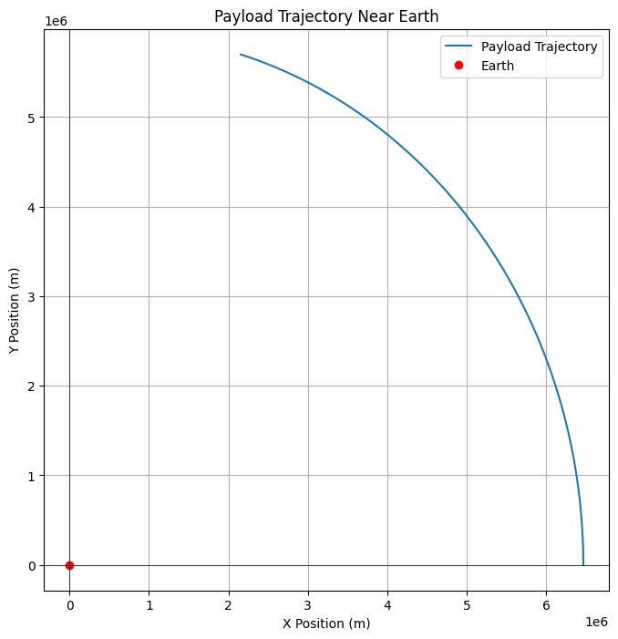
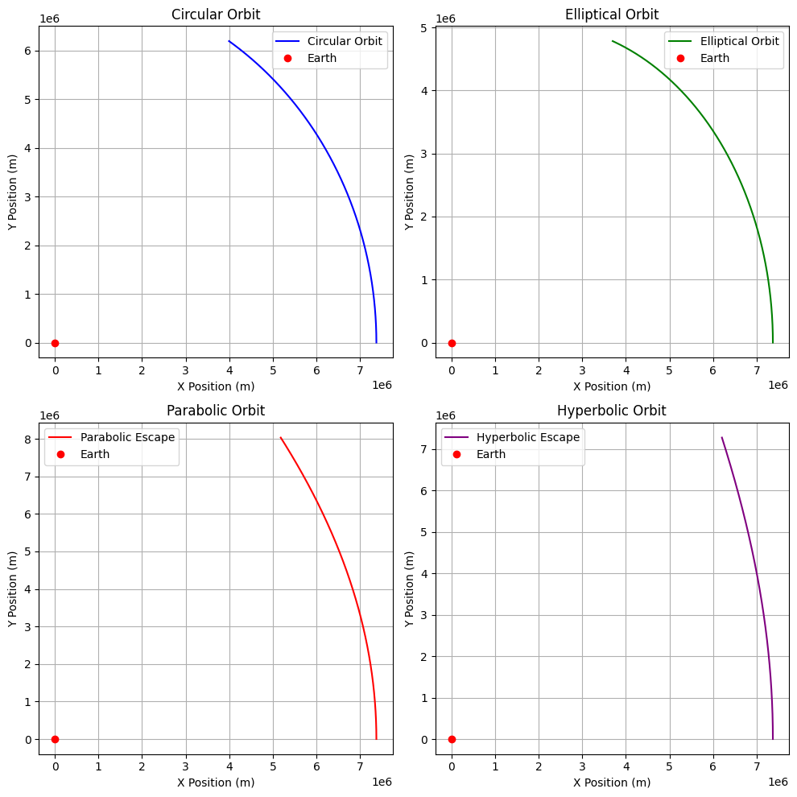

# Problem 3

# Trajectories of a Freely Released Payload Near Earth

## Motivation

When a payload is released from a moving rocket near Earth, its trajectory is influenced by initial conditions (position, velocity) and gravitational forces. This is crucial for understanding orbital insertion, reentry, and escape scenarios.

## Key Concepts

### 1. Newton's Law of Gravitation

The gravitational force \( F \) between two bodies is:

\[
F = \frac{G M m}{r^2}
\]

Where:
- \( G \) is the gravitational constant,
- \( M \) is Earth's mass,
- \( m \) is the payload's mass,
- \( r \) is the distance between the centers of Earth and the payload.

### 2. Orbital Types

#### Circular Orbit:

For a circular orbit, the required orbital velocity \( v_c \) is:

\[
v_c = \sqrt{\frac{GM}{r}}
\]

#### Elliptical Orbit:

For elliptical orbits, the velocity varies. The semi-major axis \( a \) and eccentricity \( e \) determine the orbit's shape. The vis-viva equation is:

\[
v = \sqrt{GM \left(\frac{2}{r} - \frac{1}{a}\right)}
\]

Where:
- \( v \) is the velocity at a distance \( r \),
- \( a \) is the semi-major axis,
- \( r \) is the distance from the center of Earth.

#### Parabolic Orbit:

For a parabolic orbit, the velocity is equal to the escape velocity:

\[
v = v_e = \sqrt{\frac{2GM}{r}}
\]

#### Hyperbolic Orbit:

For hyperbolic escape, the velocity exceeds the escape velocity. The specific orbital energy \( \epsilon \) is:

\[
\epsilon = \frac{v^2}{2} - \frac{GM}{r}
\]

Where \( \epsilon > 0 \) for hyperbolic trajectories.

### 3. Escape Velocity

The escape velocity \( v_e \) at distance \( r \) is:

\[
v_e = \sqrt{\frac{2GM}{r}}
\]

Where \( r \) is the radial distance from Earth's center.

Here's the equation written in proper Markdown with LaTeX formatting:

## Numerical Integration of Motion

The equations of motion under Earth's gravity are:

\[
\frac{d^2x}{dt^2} = - \frac{GMx}{(x^2 + y^2)^{3/2}}
\]

\[
\frac{d^2y}{dt^2} = - \frac{GMy}{(x^2 + y^2)^{3/2}}
\]

Where:
- \( x, y \) are the payload’s position coordinates,
- \( G \) is the gravitational constant,
- \( M \) is Earth's mass.

## Applications

- **Orbital Insertion**: Requires velocity \( v_c = \sqrt{\frac{GM}{r}} \).
- **Escape**: Achieved when \( v > v_e \).
- **Reentry**: Occurs when the payload returns with insufficient velocity to maintain orbit.

## Conclusion

The payload’s trajectory depends on initial velocity and position. By applying these equations, we can predict orbital paths, escape conditions, and reentry scenarios.
