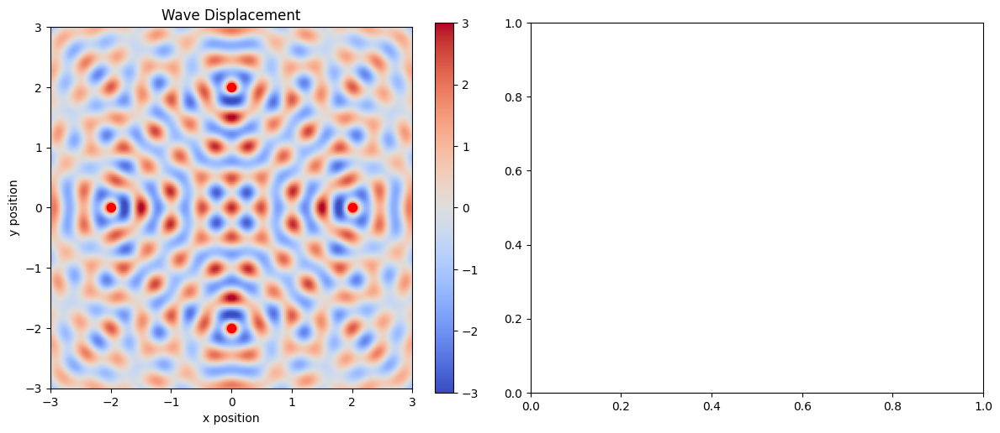

# Problem 1

# Wave Interference Analysis

## Core Equations

### Single Source Wave
For source at (x₀, y₀):

\[
\eta_i = \frac{A}{\sqrt{r_i}} \cos(kr_i - \omega t + \phi_i)
\]
\[
r_i = \sqrt{(x-x_i)^2 + (y-y_i)^2}
\]

### N-Source Superposition
\[
\eta_{total} = \sum_{i=1}^N \eta_i
\]

## Key Parameters

| Symbol | Meaning | Relation |
|--------|---------|----------|
| k | Wavenumber | \(k = \frac{2π}{λ}\) |
| ω | Angular frequency | \(ω = 2πf\) |
| rᵢ | Distance | \(r_i = \sqrt{(x-x_i)^2 + (y-y_i)^2}\) |

## Interference Conditions

### Constructive
\[
Δr = nλ \quad (n ∈ ℤ)
\]

### Destructive
\[
Δr = (n + \frac{1}{2})λ \quad (n ∈ ℤ)
\]

## Polygon Geometry

For regular N-gon:
\[
x_i = R\cos\left(\frac{2πi}{N}\right)
\]
\[
y_i = R\sin\left(\frac{2πi}{N}\right)
\]
where R = circumradius

## Pattern Features

Feature | Mathematical Condition
---|---
Nodal lines | \(\eta_{total} = 0\)
Anti-nodes | \(\eta_{total} = \text{max}\)
Symmetry | N-fold rotational