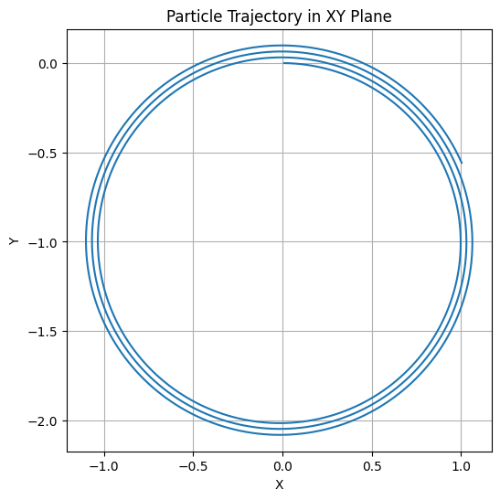

# 📘 Lorentz Force Simulation: Key Formulas

## ⚡ Lorentz Force

The Lorentz force on a charged particle is given by:

\[
\vec{F} = q(\vec{E} + \vec{v} \times \vec{B})
\]

Where:
- \( \vec{F} \): Force on the particle (N)
- \( q \): Charge of the particle (C)
- \( \vec{E} \): Electric field (V/m)
- \( \vec{v} \): Particle velocity (m/s)
- \( \vec{B} \): Magnetic field (T)

---

## 🧮 Equations of Motion

From Newton's second law:

\[
\vec{F} = m \frac{d\vec{v}}{dt}
\quad \Rightarrow \quad 
\frac{d\vec{v}}{dt} = \frac{q}{m} (\vec{E} + \vec{v} \times \vec{B})
\]

\[
\frac{d\vec{r}}{dt} = \vec{v}
\]

These are solved numerically using Euler or Runge-Kutta methods.

---

## 🔄 Euler Method (Discretized Form)

\[
\vec{v}_{n+1} = \vec{v}_n + \frac{q}{m} (\vec{E} + \vec{v}_n \times \vec{B}) \Delta t
\]

\[
\vec{r}_{n+1} = \vec{r}_n + \vec{v}_n \Delta t
\]

---

## 🔁 Runge-Kutta Method (4th Order — Conceptual)

Intermediate steps:

\[
k_1 = f(t_n, y_n)
\quad k_2 = f\left(t_n + \frac{h}{2}, y_n + \frac{h}{2}k_1\right)
\quad k_3 = f\left(t_n + \frac{h}{2}, y_n + \frac{h}{2}k_2\right)
\quad k_4 = f\left(t_n + h, y_n + hk_3\right)
\]

Then update:

\[
y_{n+1} = y_n + \frac{h}{6}(k_1 + 2k_2 + 2k_3 + k_4)
\]

---

## 🔁 Larmor Radius (for Circular Motion in Magnetic Field)

\[
r_L = \frac{mv_\perp}{|q|B}
\]

Where \( v_\perp \) is the component of velocity perpendicular to \( \vec{B} \).

---

## ⏰ Cyclotron Frequency

\[
\omega_c = \frac{|q|B}{m}
\quad \Rightarrow \quad 
T = \frac{2\pi}{\omega_c}
\]

Where:
- \( \omega_c \): Angular frequency of circular motion
- \( T \): Period of revolution

---

## 📐 Drift Velocity (for Crossed \( \vec{E} \) and \( \vec{B} \) Fields)

\[
\vec{v}_d = \frac{\vec{E} \times \vec{B}}{B^2}
\]

---

