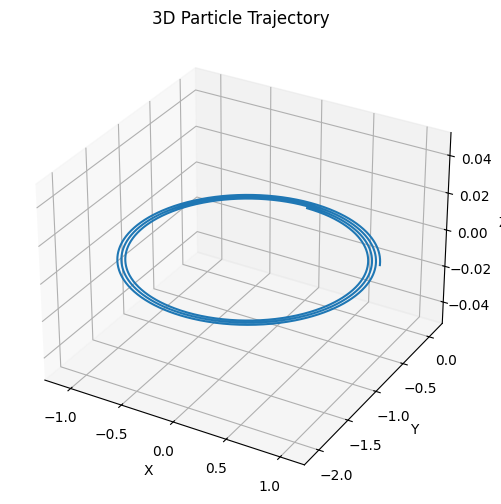

# 🧲 Lorentz Force Simulation – Extended Formula Reference

## 📌 1. Lorentz Force

\[
\vec{F} = q(\vec{E} + \vec{v} \times \vec{B})
\]

- \( \vec{F} \): Net force on the charged particle (N)
- \( q \): Electric charge (C)
- \( \vec{E} \): Electric field (V/m)
- \( \vec{v} \): Velocity vector of the particle (m/s)
- \( \vec{B} \): Magnetic field (T)

---

## 📌 2. Newton’s Second Law Applied

\[
\vec{F} = m \frac{d\vec{v}}{dt} \Rightarrow \frac{d\vec{v}}{dt} = \frac{q}{m} (\vec{E} + \vec{v} \times \vec{B})
\]

\[
\frac{d\vec{r}}{dt} = \vec{v}
\]

---

## 📌 3. Discrete Update Equations (Euler’s Method)

\[
\vec{v}_{n+1} = \vec{v}_n + \frac{q}{m} (\vec{E} + \vec{v}_n \times \vec{B}) \Delta t
\]

\[
\vec{r}_{n+1} = \vec{r}_n + \vec{v}_n \Delta t
\]

---

## 📌 4. Runge-Kutta 4th Order Method (Conceptual)

To solve \( \frac{dy}{dt} = f(t, y) \):

\[
\begin{aligned}
k_1 &= f(t_n, y_n) \\
k_2 &= f\left(t_n + \frac{h}{2}, y_n + \frac{h}{2}k_1\right) \\
k_3 &= f\left(t_n + \frac{h}{2}, y_n + \frac{h}{2}k_2\right) \\
k_4 &= f\left(t_n + h, y_n + hk_3\right)
\end{aligned}
\]

\[
y_{n+1} = y_n + \frac{h}{6}(k_1 + 2k_2 + 2k_3 + k_4)
\]

---

## 📌 5. Larmor Radius (for Circular Motion in Magnetic Field)

\[
r_L = \frac{mv_\perp}{|q|B}
\]

- \( v_\perp \): Component of velocity perpendicular to \( \vec{B} \)

---

## 📌 6. Cyclotron Frequency and Period

\[
\omega_c = \frac{|q|B}{m}
\quad \text{and} \quad
T = \frac{2\pi}{\omega_c}
\]

- \( \omega_c \): Angular frequency (rad/s)
- \( T \): Period of revolution (s)

---

## 📌 7. Drift Velocity (for Crossed \( \vec{E} \) and \( \vec{B} \) Fields)

\[
\vec{v}_d = \frac{\vec{E} \times \vec{B}}{B^2}
\]

This drift is independent of charge and mass!

---

## 📌 8. Helical Path in Uniform \( \vec{B} \)

If \( \vec{v} \) has both \( \perp \) and \( \parallel \) components to \( \vec{B} \), the motion becomes **helical**:

- \( v_\perp \rightarrow \) Circular motion
- \( v_\parallel \rightarrow \) Linear motion along \( \vec{B} \)

---

## 📌 9. Magnetic Mirror Effect

In a non-uniform magnetic field (e.g., magnetic bottle):

\[
\mu = \frac{mv_\perp^2}{2B} = \text{constant}
\]

The particle can be reflected if \( B \) increases and \( v_\perp \) dominates.

---

## 📌 10. Energy Considerations

- Magnetic field does **no work**: It only changes **direction**, not speed:

\[
\vec{F}_B \cdot \vec{v} = 0
\]

- Electric field can change **speed** and **energy**:

\[
W = q \vec{E} \cdot \vec{d}
\]

---

---

