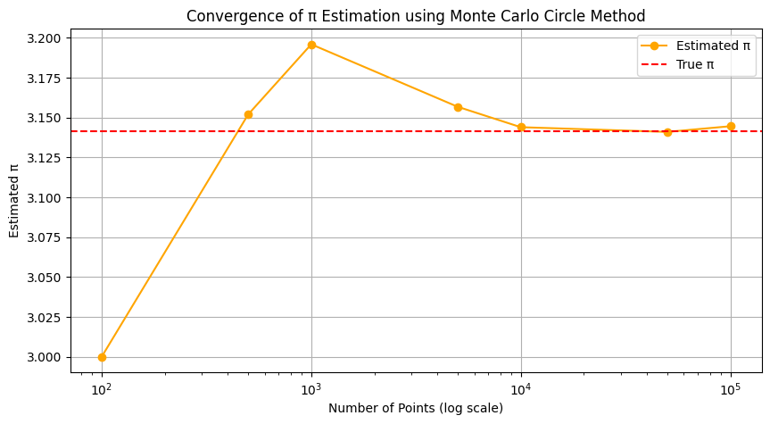
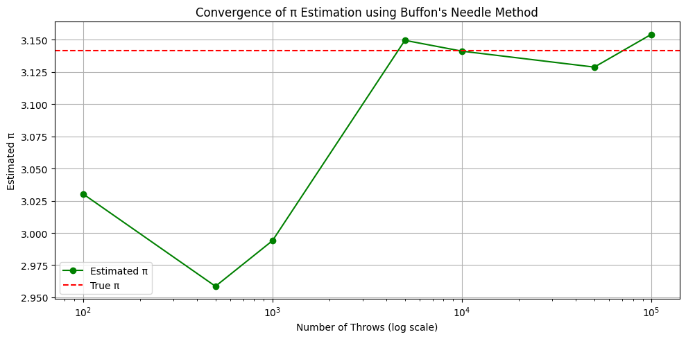
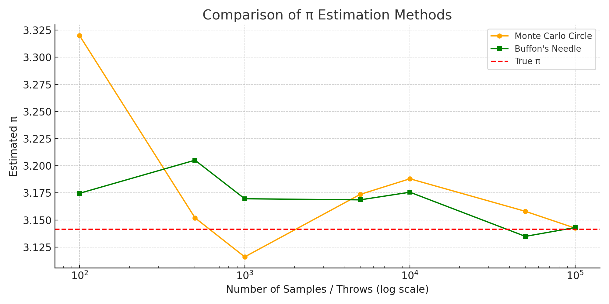

# Estimating Pi using Monte Carlo Methods

## 1. Motivation
Monte Carlo simulations leverage randomness to solve complex numerical and probabilistic problems. One elegant application is estimating the mathematical constant \( \pi \). By generating random points or simulating physical systems like Buffon's Needle, we can approximate \( \pi \) using geometric probability.

These methods not only demonstrate foundational ideas in probability, geometry, and computation but also showcase the practical usefulness of randomness in physics, finance, and computer science.

---

## 2. Method 1: Estimating \( \pi \) Using a Circle


### Theoretical Foundation
For a unit circle inscribed in a square of side length 2 (from -1 to 1 on both axes), the area of the circle is:

```markdown
A_{circle} = \pi r^2 = \pi \cdot 1^2 = \pi
```

And the area of the square is:

```markdown
A_{square} = (2r)^2 = 4
```

If we generate points uniformly in the square and count how many fall inside the circle, the ratio:

```markdown
\frac{\text{points inside circle}}{\text{total points}} \approx \frac{\pi}{4}
```

Thus:

```markdown
\pi \approx 4 \cdot \left( \frac{\text{points inside circle}}{\text{total points}} \right)
```

### Simulation Steps
1. Generate random (x, y) points in a square [-1, 1] x [-1, 1].
2. Check whether each point lies inside the unit circle: \( x^2 + y^2 \leq 1 \).
3. Count how many fall inside the circle.
4. Estimate \( \pi \) using the formula above.

### Visualization
A scatter plot is used to show points inside the circle (blue) and outside (red).

### Analysis
As the number of points increases, the accuracy of \( \pi \) improves due to the Law of Large Numbers. Convergence rate can be slow, requiring many samples for precision.

---

## 3. Method 2: Estimating \( \pi \) Using Buffon's Needle


### Theoretical Foundation
Buffon's Needle is a probability problem: If a needle of length \( L \) is dropped onto a plane with parallel lines distance \( D \) apart (where \( L \leq D \)), the probability it crosses a line is:

```markdown
P = \frac{2L}{\pi D}
```

Rearranging for \( \pi \):

```markdown
\pi \approx \frac{2L \cdot N}{D \cdot C}
```

Where:
- \( N \) is the number of throws,
- \( C \) is the number of times the needle crosses a line.

### Simulation Steps
1. Randomly generate the center position and angle of the needle.
2. Determine if it crosses a line.
3. Count the number of crossings.
4. Apply the above formula to estimate \( \pi \).

### Visualization
This method can be visualized using lines and simulated needle placements.

### Analysis
Buffon's Needle converges more slowly and is more sensitive to geometric setup but offers a fascinating link between geometry and probability.

---

## 4. Comparison and Conclusion
| Method              | Accuracy (Sample Size = 10,000) | Convergence Rate | Complexity |
|---------------------|----------------------------------|------------------|------------|
| Monte Carlo Circle  | High                            | Fast             | Simple     |
| Buffon's Needle     | Moderate                        | Slower           | Moderate   |

### Final Notes
- Monte Carlo Circle is preferred for simplicity and faster convergence.
- Buffon's Needle is an excellent pedagogical example of probabilistic geometry.

---

## 5. References
- Monte Carlo Methods in Scientific Computing
- Buffon's Needle Probability Problem, Wikipedia
- Computational Physics by Mark Newman
- Python libraries: NumPy, Matplotlib
