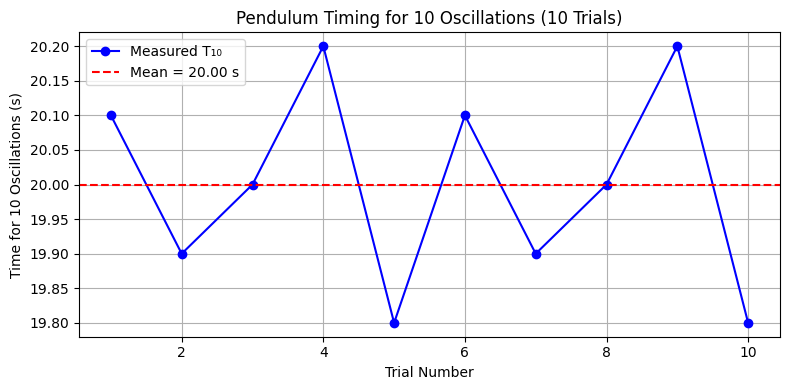

# Measuring Earth's Gravitational Acceleration with a Pendulum

## Motivation
The acceleration due to gravity, **g**, is a fundamental physical constant. Measuring it with a pendulum allows us to explore oscillatory motion and analyze uncertainties in experimental physics.

---

## Materials
- String (~1 meter)
- Small weight (e.g., coins or keychain)
- Stopwatch or phone timer
- Ruler (resolution: 0.01 m)

---

## Procedure
1. Measure length of pendulum:  
   \( L = 1.0 \text{ m},\quad \Delta L = \frac{0.01}{2} = 0.005 \text{ m} \)

2. Record 10 measurements of time for 10 oscillations:

| Trial | Time (s) |
|-------|----------|
| 1     | 20.1     |
| 2     | 19.9     |
| 3     | 20.0     |
| 4     | 20.2     |
| 5     | 19.8     |
| 6     | 20.1     |
| 7     | 19.9     |
| 8     | 20.0     |
| 9     | 20.2     |
| 10    | 19.8     |

---

## Calculations

- Mean time \( \overline{T_{10}} = 20.0 \text{ s} \)
- Standard deviation \( \sigma_T = 0.1549 \text{ s} \)
- Uncertainty in mean:  
  \( \Delta T_{10} = \frac{\sigma_T}{\sqrt{10}} = 0.049 \text{ s} \)

- Period of one oscillation:  
  \( T = \frac{\overline{T_{10}}}{10} = 2.0 \text{ s} \)  
  \( \Delta T = \frac{\Delta T_{10}}{10} = 0.0049 \text{ s} \)

- Gravity:  
  \( g = \frac{4 \pi^2 L}{T^2} = 9.87 \text{ m/s}^2 \)

- Uncertainty in gravity:  
  \[
  \Delta g = g \cdot \sqrt{\left(\frac{\Delta L}{L}\right)^2 + \left(\frac{2\Delta T}{T}\right)^2} = 0.065 \text{ m/s}^2
  \]

---

## Final Result
- **Measured**: \( g = 9.87 \pm 0.07 \text{ m/s}^2 \)
- **Expected**: \( g = 9.81 \text{ m/s}^2 \)

---

## Analysis
- Small timing variability affects \( \Delta T \), influencing \( \Delta g \)
- Ruler resolution impacts \( \Delta L \)
- Assumption: ideal pendulum with small angle (<15°), no air resistance

---

## Visualization

*Timing for 10 oscillations across trials.*
